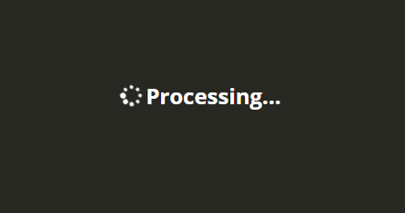
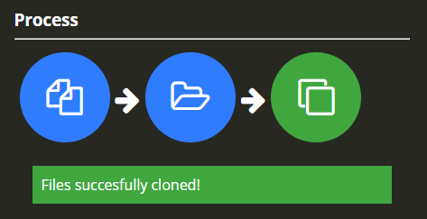

# FileCloner &middot; 

Small desktop app to clone files. The process is the following:

* Choose the number of resulting files. It does not matter the number of input files, the cloner will clone until reaching the number in the order given.
* Write an optional suffix for the files (the prefix will be a number so the files are ordered)
* Choose an order. If you choose "ordered", the resulting files will preserve the order of the input files. For example, if 3 files are provided and 5 are the number or resulting files requested, the cloned files will be 1,2,3,1,2. If "grouped" order is selected, the outcome will be 1,1,2,2,3.
* Follow the process buttons. Select input files, select destination, and clone!

## Demo

* Main screen:

* Processing files:

* Process done:

## Getting Started

### Prerequisites

* Latest node and npm installed.

### Installing

* Clone the project

* Install dependencies:

    `npm install`

* Start desktop app (live reload is enabled for the web content thanks to [electron-reload](https://github.com/yan-foto/electron-reload), hard reset currently not working):

    `npm start`

## Running the tests

Work in progress

## Deployment

* Only configured for Windows (at the moment), this command will generated a portable executable on dist folder:

    `npm run dist`

## Built With

* [Electron](https://electronjs.org/)
* [React](https://reactjs.org/)
* [Node.js](https://nodejs.org/es/)
* [Sass](https://sass-lang.com/)

## Versioning

We use [SemVer](http://semver.org/) for versioning. For the versions available, see the [tags on this repository](https://github.com/mrganser/filecloner/tags). 

## Authors

* **[mrganser](http://mrganser.com)**

See also the list of [contributors](https://github.com/mrganser/filecloner/contributors) who participated in this project.

## License

This project is licensed under the MIT License - see the [LICENSE](LICENSE) file for details
