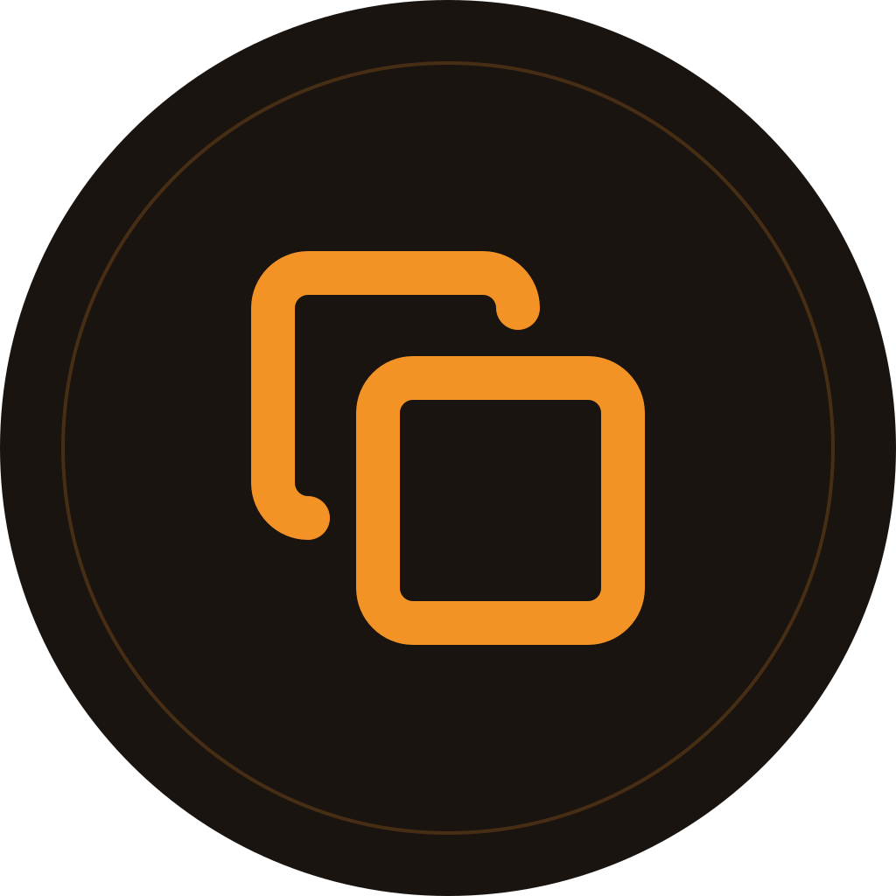
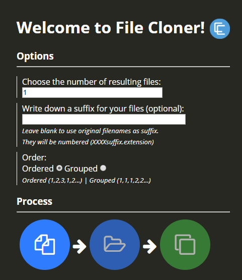

# FileCloner &middot; 

Small desktop app to clone files. The process is the following:

- Choose the number of resulting files. It does not matter the number of input files, the cloner will clone until reaching the number in the order given.
- Write an optional suffix for the files (the prefix will be a number so the files are ordered)
- Choose an order. If you choose "consecutive", the resulting files will preserve the order of the input files. For example, if 3 files are provided and 5 are the number of resulting files requested, the cloned files will be 1,2,3,1,2. If "grouped" order is selected, the outcome will be 1,1,2,2,3.
- Drag and drop to reorder your selected files before cloning
- Follow the process buttons. Select input files, select destination, and clone!

## Demo image

## Getting Started

### Prerequisites

- Node.js 18+ and npm installed.

### Installing

- Clone the project

- Install dependencies:

  `npm install`

- Start desktop app (with hot reload):

  `npm start`

## Running the tests

- Run tests in watch mode:

  `npm test`

- Run tests once:

  `npm run test:run`

- Run tests with coverage:

  `npm run test:coverage`

## Deployment

- Build for your platform:

  `npm run dist`

## Built With

- [Electron](https://electronjs.org/)
- [React](https://reactjs.org/)
- [TypeScript](https://www.typescriptlang.org/)
- [Vite](https://vitejs.dev/)
- [Tailwind CSS](https://tailwindcss.com/)
- [dnd-kit](https://dndkit.com/) - Drag and drop for file reordering

## Versioning

We use [SemVer](http://semver.org/) for versioning. For the versions available, see the [tags on this repository](https://github.com/mrganser/filecloner/tags).

## Authors

- **[mrganser](http://mrganser.com)**

See also the list of [contributors](https://github.com/mrganser/filecloner/contributors) who participated in this project.

## License

This project is licensed under the MIT License - see the [LICENSE](LICENSE) file for details
